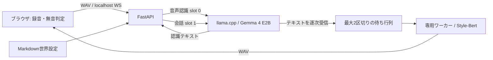

# 構成

## プロセスと文脈

`launch.py`がllama.cppとアプリを起動。TTSは専用Pythonワーカーに隔離し、モデル切り替え時に前のワーカーを終了します。同時に常駐するTTSは1つです。Gemmaの重みは1コピーで、音声認識と会話に異なるKVスロットを使います。

WebSocket接続ごとに会話履歴、世界設定、上限64件のトークン数キャッシュを保持。世界設定の変更は履歴と数え上げキャッシュをリセットします。トークン数のキーはテキストそのものではなくハッシュです。文脈が足りなければ古い会話から除き、世界設定と現在の質問は黙って切り捨てません。

GPU処理全体は一つの会話パイプラインに制限しています。同じ会話内では、Gemmaのストリーム受信とTTSを並行実行します。待ち行列は2区切りまでなので、遅いTTSでテキストが無制限に溜まりません。最初の音声だけは自然な読点でも早めに区切ります。

## 停止

停止は生成タスクと待ち行列をキャンセルします。すでに実行中のPyTorch推論は安全に終了するまで待ち、次の推論と重ならないようにします。各返答にIDを付け、ブラウザは停止した返答の遅着パケットを無視します。Web Audioと試聴プレイヤーも停止します。

## 日本語TTSの高速経路

`sts/fast_tts.py`はStyle-Bert-VITS2 2.5.0のJP-Extraに限定したアダプターです。上流のテキスト正規化・音素生成・スタイル補間・ノイズ設定・出力正規化を維持します。BERTで実際に参照する22層目まで計算し、未使用の最終2層とMLMヘッドを省略。不要な中間状態の保持、CPUとの特徴量往復、毎回のCUDAキャッシュ解放を避けます。畳み込みのweight normalizationはロード時に一度だけ畳み込みます。

モデルは常駐しますが、文章や合成音声を結果キャッシュには保存しません。繰り返すテスト文だけを高速化する実装ではありません。`tts_fast: false`で上流経路を比較できます。

## ブラウザ

AudioWorkletは128サンプルごとの投稿を1024サンプルにまとめ、転送可能なバッファを使用。終了時は端数をflushしてから送信します。PCM16 WAVはブラウザで直接デコードし、一般のコーデック処理を省略します。対応外のWAV形式は標準デコーダーへフォールバック。Web Audioはinteractive設定で15ms先に再生を予約します。

発話中の逐次ASRや全二重会話ではありません。無音600ms後に一つの録音を送信する方式です。表示される「再生予約」はブラウザ上の計測であり、スピーカーから実際に音が出た時刻を測るものではありません。
